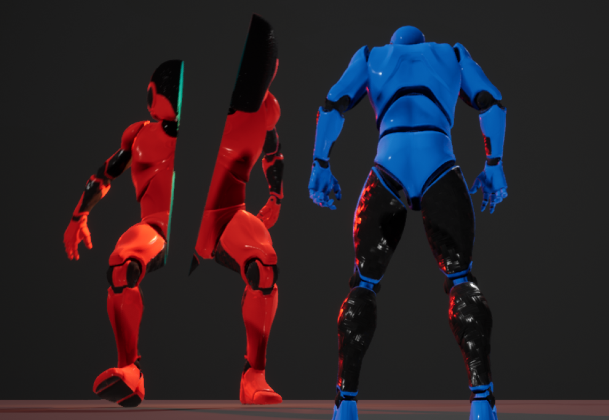

# Welcome to my game project!

This game was made for a university project.
It is a logical game demo with 6 simple levels.

This was the very beginning of my game development history.

## How to launch

The game is currently only available on a Windows 64-bit OS. However, most of the time 32-bit Windows is fine as well. To play the game, simply click on

`⬇ Code > Download ZIP`

After downloading, you should be able to unzip and start the slicegame-master/Onlab.exe file.

## Thank you for playing!

## In case of errors
If an error with message starting like "Failed to open descriptor file" comes up, please navigate to [slicegame/Onlab/Content/Paks/Onlab-WindowsNoEditor.pak](https://github.com/lyaflora/slicegame/blob/master/Onlab/Content/Paks/Onlab-WindowsNoEditor.pak) here in the github repository, and press `Download`. Then replace the exisiting file on your PC in the same folder (slicegame-master/Onlab/Content/Paks) with the downloaded file (Onlab-WindowsNoEditor.pak). It should start without complications now.